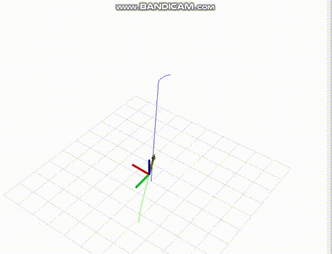

gz_rviz_drone_package -- пакет запускающий мир, состоящий из 7x7 поля aruco меток, с тремя шарами разного цвета и двумя px4 дронами x500_vision. Для тестирования нужна мощная видеокарта.

rviz_drone_package -- реализует пример управления дроном, взлет, полет по предопределнной траектории. Визуализация в rviz.

 
-----------------------------------------------------------------------------------------|
Сначала необходимо собрать
colcon build --packages-select px4_msgs

Все пакеты ROS 2 начинаются с выполнения команды
ros2 pkg create --license Apache-2.0 <pkg-name> --dependencies [deps]
 
You need to create a bridge with either ros_gz_image or ros_gz_bridge.
ros2 run ros_gz_image image_bridge /camera
ros2 run ros_gz_bridge parameter_bridge /camera@sensor_msgs/msg/Image@ignition.msgs.Image